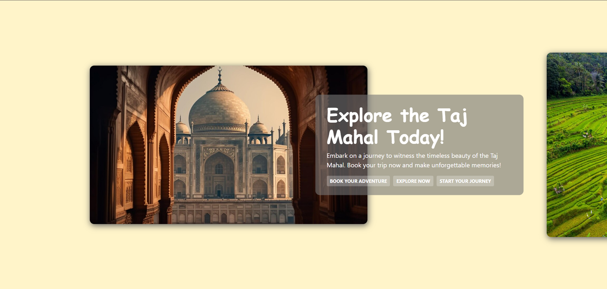
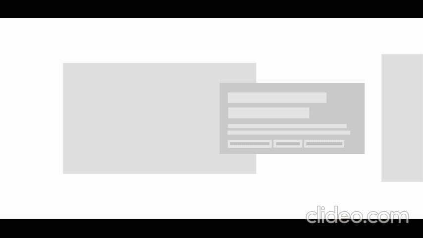
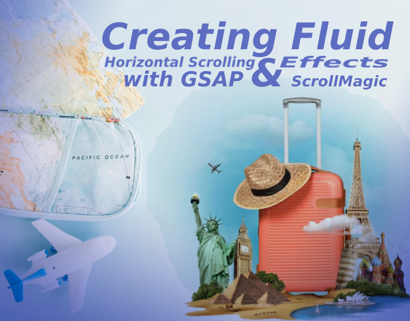

# Creating Fluid Horizontal Scrolling Effects with GSAP and ScrollMagic

### Author
##### Virendra D. Verma

<a href="https://www.linkedin.com/in/dharmendraverma95/" target="_blank">LinkedIn Profile </a>

<a href="https://www.behance.net/dhirukumar" target="_blank">Behance Profile </a>

# Project Overview

This project demonstrates how to create smooth, fluid horizontal scrolling effects on a website using GSAP (GreenSock Animation Platform) and ScrollMagic. By combining these two powerful libraries, you can implement engaging, scroll-driven animations that enhance the user experience with seamless horizontal scroll interactions.

## Features
- Fluid Horizontal Scrolling: Create smooth horizontal scrolling using mouse wheel, trackpad, or drag events.
- Scroll-driven Animations: Trigger animations as the user scrolls, with full control over timing and easing.
- Interactive Navigation: Add custom scroll behavior with ScrollMagic to make sections pop up or animate as you scroll.
- Responsive Design: The effects are fully responsive, ensuring that the layout adjusts to different screen sizes and devices.
- Smooth Performance: Thanks to GSAP's optimized animations, the scroll effects run smoothly even on lower-end devices.

# Preview
Horizontal Scroll List and Card Effects
 

 
Horizontal Scroll List and Card Effects Start & End Point 
 

 
Horizontal Scroll List and Card Effects UI UX Layout Start & End Point
 

 
Horizontal Scroll List and Card Effects UI UX Layout
 

 
Cover
 

 

### Technologies Used
<ul>
  <li>Graphic Design Software: Photoshop, Figma (for mockups)</li>
  <li>Web Tools (Optional): HTML5, CSS3 and JavaScript (Vanilla JS or jQuery for animation effects)  for any digital presentations or landing pages</li>
  <li>GSAP (GreenSock Animation Platform): A high-performance JavaScript library for animations.
</li>
  <li>ScrollMagic: A library for creating scroll-based animations with full control over triggering and duration.</li>
</ul>

###  Acknowledgments
Inspired by the power of CSS positioning and scrolling techniques.